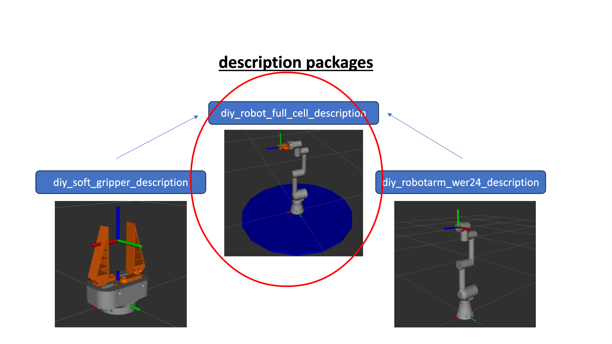
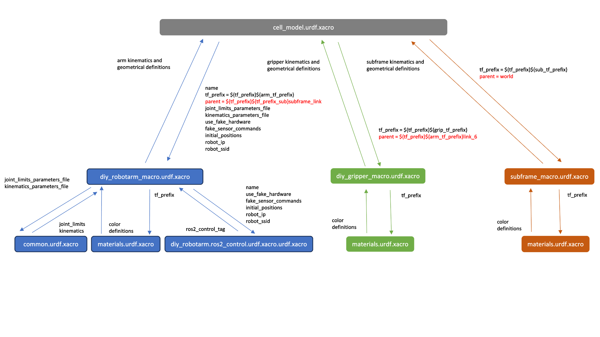

# diy_robot_ful_cell_description


## thematical Classification

This repo contains a ros2 package which describes the full cell setup of our diy-robot secene.
The scene will include descriptions of the Base (Table, Box, ...), the 6-Axis Robotarm (https://github.com/RobinWolf/diy_robotarm_wer24_description) and the Parallel-Gripper . in our case with mounted soft-fingers (https://github.com/RobinWolf/diy_soft_gripper_describtion).

We use Docker for development (dev branch) and deployment (main branch) to avoid version and dependencies issues.
While building the container the depencencie-reops for the robotarm and gripper are cloned from GitHub and setup automated.
To run the package, you just have to source the run.sh script file. The container will start and you can work with the provided package, modify it or include it as an dependencie to another packages!

The main idea is, that this repo can be cloned inside a docker-container containing and combining all packages for operationg the Robot (e.g. description, drivers, moveit2, applivation) Using differnet docker containers is very likely, because this makes the whole integration very modular.

Refer to the main Readme.md https://github.com/mathias31415/diy_robotics/blob/main/ROS-Packages/ROS-OVERVIEW.md for a general overview.



## Package Structure


 - images and README.md are only for docomentation purposes
 - Dockerfile, run.sh and dds_profile.xml are used to create the docker container where ROS is running in
 - CMakeLists.txt and package.xml are defining this build process (wich dependencies are needed, which file should be installed where in the created directories, ...)
 - meshes, rviz, urdf, config and launch are the directories which are containing the source files for this package, they will be described in the following


## URDF Definition

For this URDF definition we use the ROS xacro extention to ensure clear structures and the best modularity.

The graphics below show how the whole cell is assembled from sub-description packages diy_robotarm_wer24_description (https://github.com/RobinWolf/diy_robotarm_wer24_description/tree/main) and diy_soft_gripper_description (https://github.com/RobinWolf/diy_soft_gripper_description).
In addition to the xacro sub-urdf definitions we have implemented the usage of several confuguration files in the "config" directory. These refer to the ````diy_robotarm_macro.urdf.xacro````.




## Launch

By running the launch file ````visualization.launch.py```` automatically when you start the docker container by sourcing the run script ````./run.sh```` you will launch Rviz and the Joint State Publisher GUI. This is only for visualization and checking purposes, because we don't do a real bringup of the robot model. Joint States are just published by the GUI on the specific ROS-topic.

Now you should be able to move the robot arm around in Rviz by sliding the bars of the Joint State Publisher GUI. You can not actuate the gripper or a real robot in this development stage, therefore you need the drivers to run.
